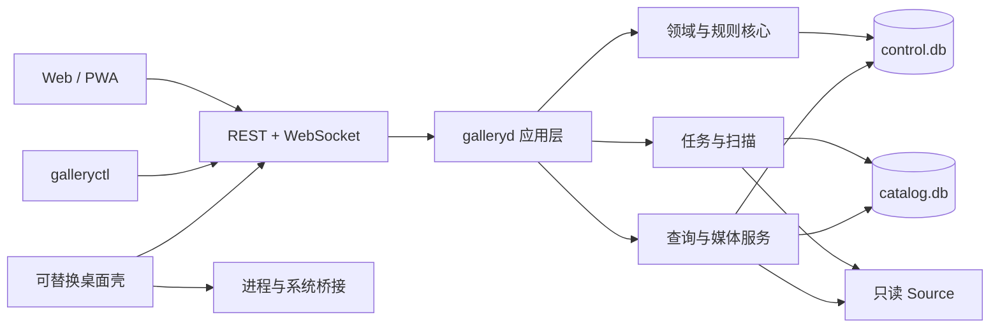

# 系统架构与模块边界

> 类型：规范。技术基础、模块职责和依赖方向以本文为唯一权威来源。

## 总体形态

Gallery 采用 **API-first、模块化单体、单主进程**。`galleryd` 包含领域、数据、扫描、查询、媒体、任务、HTTP 和 WebSocket 能力；Web/PWA 通过正式 API 工作；`galleryctl` 与桌面壳只消费公开控制契约。



## 已冻结技术基础

| 层 | 选择 | 边界 |
| --- | --- | --- |
| 后端语言 | Go | 核心不得依赖 cgo 才能完成基础发行；例外需 ADR |
| 服务框架 | 标准 `net/http` 为基础 | 可使用小型路由/中间件库，不引入重型应用容器 |
| 数据库 | SQLite WAL | `control.db` 与 `catalog.db` 生命周期分离，不引入远程 DB 服务 |
| API | REST/JSON + OpenAPI | 资源和长任务语义优先；内部实现不得泄露为客户端契约 |
| 实时 | 版本化 WebSocket | 用于任务状态、失效和双向订阅；轮询可作恢复路径 |
| 规则条件 | 受限 CEL | 仅作为规则层的一部分，不能取代原语、Schema 或插件边界 |
| 主 UI | 响应式 Web/PWA | 所有业务能力在普通浏览器可用 |
| 桌面壳 | 可替换适配器 | Wails 仅为当前候选，不是后端依赖 |

不引入微服务、外部消息队列、Redis、PostgreSQL 或独立搜索服务，除非 [ADR 索引](../ADR/README.md) 中的重新审议条件成立。

## 模块职责

| 模块 | 拥有 | 不得拥有 |
| --- | --- | --- |
| bootstrap/config | 进程配置、AppDirs、模式选择、依赖装配 | 平台业务规则、数据库查询语义 |
| control | Library/Source、CanonicalWork/CanonicalCreator/CanonicalMedia、Binding、Overlay、账户、授权、分享 | 扫描派生行、Catalog 内部行号、FTS 文档 |
| rules | RuleSet/Version、Schema 校验、编译、Rule IR、Trace/Impact | 文件写入、网络访问、账户判定 |
| catalog | SourceWork/SourceCreator/SourceMedia、ContentBlob/FileLocation、查询投影、Catalog/Overlay projection revision、publication、GC | 用户事实或 Canonical 实体的权威副本 |
| scanner | 发现、规则执行、候选关联、staging 构建 | 直接切换用户 Overlay、向媒体根写入 |
| jobs | 持久任务、attempt、取消、重试、资源池、恢复协调 | 业务事实本身；Job 不是 Catalog 成功事实源 |
| query | 有效字段解析、过滤、搜索、排序、`query_publication_id` 快照分页 | 客户端展示文案、系统 locale 排序 |
| media | CanonicalMedia/ContentBlob 解析、Range/ETag、派生资源调度 | 公共 URL 暴露绝对路径、隐式修改源文件 |
| transport | HTTP、OpenAPI、错误信封、WebSocket、限流 | 领域决策和平台特例 |
| platform adapters | 文件身份、Watcher、Path、进程、工具、凭据等 OS 差异 | Canonical/规则/查询语义 |
| clients | 展示、交互、本地视图状态 | 权限推断、排序复刻、直接数据库访问 |

## 依赖方向

```text
transport / clients
        ↓
application services
        ↓
domain + rules + ports
        ↓
control/catalog repositories + platform adapters
```

- 领域核心只依赖抽象端口和不可变值对象，不依赖 HTTP、SQLite、Wails 或具体操作系统。
- `catalog` 可以读取 control 提供的版本化投影输入，但不能把查询投影反向当作用户事实。
- `scanner` 经规则编译后的 Rule IR 工作，不读取 UI 表单或 Provider 名称分支。
- Web、CLI 和壳均不得导入后端内部包；只使用 OpenAPI、WebSocket 和受控进程描述符。

## 进程与并发

- 单个 `galleryd` 对一组 AppDirs 只允许一个写者实例；第二实例必须明确失败或连接既有实例。
- HTTP 读请求、扫描、哈希、缩略图和外部工具使用不同的有界资源池，避免一种工作耗尽全部资源。
- 长任务先写持久 Job，再由进程内调度器执行；不得把不可恢复工作只放在 goroutine 内。
- 取消是协作式的：停止构建、清理未发布候选，保持旧 Catalog/Overlay projection revision 元组可读。
- SQLite 连接、事务和 busy timeout 由数据模块统一配置，业务模块不得各自发明写入策略。

## 数据文件和生命周期

| 资产 | 特性 | 恢复方式 |
| --- | --- | --- |
| `control.db` | 不可重建、必须备份 | 备份恢复；不得通过重扫猜回 |
| `catalog.db` | 可重建；保存 Source-derived、Blob/Location 和 revision 化查询投影，publication 是当前查询事实 | 从 Source + RuleVersion + control 中的稳定 Binding/Overlay 重建 |
| 搜索索引 | v1 与 Catalog 同库同 revision | 随 Catalog 重建 |
| 缩略图/转码缓存 | 可重建 | 按 Blob + transform version 重新生成 |
| 日志/诊断 | 运维数据 | 按保留策略轮转，不参与业务恢复 |

两个数据库不假定跨库原子事务；跨库顺序和恢复由 [扫描、Catalog 与任务](04-扫描-Catalog与任务.md) 定义。

## 部署形态

- **服务模式**：独立 `galleryd` + 浏览器，是所有平台的基线形态。
- **便携模式**：可将后端、Web 资源和可选壳组成发行物，但用户数据必须与程序资源分离。
- **容器模式**：媒体卷只读、AppDirs 独立可写；通过容器门禁后才能列为正式支持。
- **桌面模式**：壳启动或连接 `galleryd`，不得改变 API、数据或权限边界。

## 明确不冻结的实现细节

本文不冻结 Go 包名、类/函数名、SQLite 表名、SQL Schema 升级框架、HTTP 路由的最终细粒度、前端框架或 CSS 组件库。它们可在不破坏模块职责、数据所有权和公开契约的前提下由实现决定。

对应决策见 [ADR-001](../ADR/ADR-001-产品与技术基础.md)。
