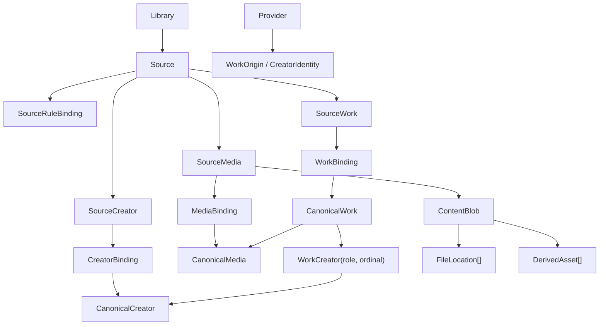

# 领域模型与数据所有权

> 类型：规范。实体语义、身份、所有权和生命周期以本文为唯一权威来源。

## 两类事实

Gallery 必须先区分“从 Source 可重新发现的事实”和“用户或产品长期维护的事实”。数据库文件只是承载，不改变所有权。

| 事实层 | 权威位置 | 典型内容 | 删除后的语义 |
| --- | --- | --- | --- |
| Source-derived | `catalog.db` | SourceCreator、SourceWork、SourceMedia、提取 metadata/tag、DiscoveredFile、搜索文档、规则派生封面 | 可按 Source + RuleVersion 重扫恢复 |
| Canonical / User Overlay | `control.db` | CanonicalCreator、CanonicalWork、CanonicalMedia、Binding、Override、ManualTag、CustomCover、Collection、Favorite、HiddenState、ReadingProgress、UserNote、Share | 不可从媒体目录恢复，必须备份 |
| 可重建查询投影 | `catalog.db` | WorkProjection、CreatorProjection、MediaProjection、有效标题/标签/封面、授权过滤键、排序键、搜索文本 | 从两类权威事实重放，不是新的权威来源 |

`control.db` 不只是账户库；它是所有不可重建产品状态的权威库。重扫不得覆盖其中任何事实。

## 核心关系



## 实体定义

| 实体 | 含义与身份 |
| --- | --- |
| Library | 用户可查询和授权的逻辑媒体集合；拥有一个或多个 Source |
| Source | 一个明确注册的只读输入根及扫描策略；身份是持久 `source_id`，路径可变 |
| Provider | 外部内容生态的轻量注册表；提供名称、图标、URL 模板和 metadata namespace，不拥有业务分支 |
| SourceRuleBinding | Source 与 RuleVersion、RuleParameters、Provider 范围和优先级的规则绑定；它不是 Source-derived 实体到 Canonical 实体的 Binding |
| SourceWork / SourceCreator / SourceMedia | 某次规则解释后从 Source 发现的派生事实 |
| CanonicalWork | 用户长期看到和组织的规范作品；可关联多个 SourceWork 和多个 Origin |
| CanonicalCreator | 规范创作者；可关联多个 SourceCreator 和 CreatorIdentity |
| WorkCreator | CanonicalWork 与 CanonicalCreator 的多对多关系，带 `role`、`ordinal` 和可选 credit |
| WorkOrigin | CanonicalWork 在某 Provider 下的外部 ID、URL、发现时间和来源信息 |
| CanonicalMedia | CanonicalWork 中一个有顺序、有角色的逻辑 occurrence；身份是持久 `media_id` |
| ContentBlob | 一组确定字节；v1 以算法版本 + 完整 SHA-256 确认 |
| FileLocation | Blob 当前或历史所在位置；保存 Source、相对路径、平台文件身份线索和状态 |
| DerivedAsset | 由 ContentBlob、变换 ID/版本和参数产生的缩略图、预览或转码 |
| WorkBinding / CreatorBinding / MediaBinding | 稳定 Source 引用到对应 Canonical 实体的长期关联，不以 Catalog 行号或路径为主键 |
| Overlay | 用户覆盖、手动标签、封面选择、隐藏、收藏、进度和备注等长期事实 |
| WorkProjection / CreatorProjection / MediaProjection | 为查询、排序、搜索和显示生成的 revision 内部投影；不是 Canonical 权威副本 |

## 实体所有权矩阵

| 实体或概念 | 权威数据库 | 是否可重建 | 是否属于 Catalog revision | 永久引用方式 |
| --- | --- | ---: | ---: | --- |
| CanonicalWork | `control.db` | 否 | 否 | 持久 Canonical ID |
| CanonicalCreator | `control.db` | 否 | 否 | 持久 Canonical ID |
| CanonicalMedia | `control.db` | 否 | 否 | 持久 Canonical ID |
| SourceRuleBinding | `control.db` | 否 | 否 | 持久 binding ID + Source ID + RuleVersion `semantic_hash` |
| WorkBinding | `control.db` | 否 | 否 | SourceWork 稳定引用 |
| CreatorBinding | `control.db` | 否 | 否 | SourceCreator 稳定引用 |
| MediaBinding | `control.db` | 否 | 否 | SourceMedia 稳定引用 |
| Overlay | `control.db` | 否 | 否 | Canonical ID + Overlay 类型/版本 |
| SourceWork | `catalog.db` | 是 | 是 | SourceWork 稳定键 |
| SourceCreator | `catalog.db` | 是 | 是 | SourceCreator 稳定键 |
| SourceMedia | `catalog.db` | 是 | 是 | SourceMedia 稳定键 |
| WorkProjection | `catalog.db` | 是 | 是，并绑定 Overlay projection revision | revision 内部投影 + CanonicalWork ID |
| CreatorProjection | `catalog.db` | 是 | 是，并绑定 Overlay projection revision | revision 内部投影 + CanonicalCreator ID |
| MediaProjection | `catalog.db` | 是 | 是，并绑定 Overlay projection revision | revision 内部投影 + CanonicalMedia ID |
| ContentBlob | `catalog.db` | 是 | 是 | 哈希算法版本 + 完整 digest |
| FileLocation | `catalog.db` | 是 | 是 | Source ID + 位置身份版本 + Source 内位置键 |
| DerivedAsset | `catalog.db` 的可重建登记；字节位于 AppDirs 缓存 | 是 | 否，不属于 publication 核心 | Blob 稳定引用 + 变换版本 + 参数哈希 + 相关 Overlay 输入版本/哈希 |

`control.db` 中的永久事实不得依赖 `catalog.db` 的 revision 内部行号或临时主键。跨库引用只允许使用持久 Canonical ID、稳定 Source 引用或“哈希算法版本 + digest”等可在重建后重新命中的值。Catalog 删除重建后，Binding 必须依靠稳定 Source 引用恢复，不能保存或复用旧 Catalog row ID。

## 稳定 Source 引用

Binding 的来源端至少由下列稳定语义组成，具体字段可按 Provider/规则裁剪：

```text
source_id
provider_id
external_id?       # 最强候选
source_key?        # RuleVersion 生成的稳定键
identity_version
```

相对路径只作为最后关联线索。重扫后依次使用外部 ID、规则稳定键、已知别名、文件身份和内容候选重新关联；置信度不足时产生 `BINDING_REVIEW_REQUIRED`，不得静默合并。

## CanonicalMedia、ContentBlob、FileLocation 和 DerivedAsset

这四个实体不能合并：

- 一个 CanonicalWork 内相同图片出现两次：两个 CanonicalMedia、一个 ContentBlob；
- 两个 CanonicalWork 使用相同字节：各自有 CanonicalMedia，可共享 ContentBlob；
- 同一文件改名或跨目录移动：CanonicalMedia/ContentBlob 不变，FileLocation 改变；
- 路径内容被替换：CanonicalMedia 可保持，当前有效内容解析为新的 ContentBlob，并可保留历史关联；
- 缩略图缓存键：ContentBlob 稳定引用 + transform ID/version + parameters hash；输出受用户裁切或自定义封面影响时，再加入相关 Overlay 输入版本或内容哈希。

ContentBlob 与 FileLocation 都是 `catalog.db` 中随 Catalog revision 发布的可重建 Source-derived 事实。CanonicalMedia 不永久持有 Catalog 内部 Blob 行号；“当前 Blob”由 MediaBinding、SourceMedia、来源优先级和当前查询投影共同解析。若用户固定某个内容版本，`control.db` 保存“哈希算法版本 + 完整 digest”等稳定 Blob 引用，而不是 Catalog row ID；Catalog 重建后用该稳定引用重新命中。

DerivedAsset 的登记和文件都可重建：登记可放在 `catalog.db` 的非 publication 核心区域，实际字节只能放在 AppDirs 缓存。用户裁切、自定义封面或其他会改变输出字节的 Overlay 是派生键输入；只改变收藏、备注等无关状态不得使缓存整体失效。

大小、首尾采样、路径、mtime、FileID、dev+inode 都只能产生关联候选。完整 SHA-256 才确认 ContentBlob；内部主键可以与 digest 分离，但永久引用必须携带算法版本和完整 digest。去重只复用字节和派生计算，不自动合并 CanonicalMedia、CanonicalWork 或用户状态。

## Provider、Source 和 Origin

- Source 回答“从哪里读取”；Provider 回答“内容来自哪个外部生态”；Origin 回答“这个实体在该生态中的身份”。
- 一个 Source 可发现多个 Provider，一个 Provider 可出现在多个 Source。
- Provider 不成为 `switch platform` 的理由；结构差异由 RuleVersion/参数表达，超出规则能力时才进入版本化插件边界。
- 相同 Provider/external ID 是强关联候选；跨 Provider 相同 ID 不自动等同。

## 有效字段解析

字段级有效值必须保留 Origin 和 Trace，按以下顺序确定：

1. 用户显式 Override；
2. 用户选择的首选 Origin；
3. SourceRuleBinding 显式优先级；
4. provider ID、source ID、source key 的确定性回退。

多值字段不能使用通用“后扫描覆盖前扫描”。每个字段策略必须明确为 union、ordered-union、choose-one 或其他版本化策略。手动标签按“提取集合减 suppress，再加 manual add”解析。

## 生命周期规则

- 合并 CanonicalCreator：以有效创作者指针把被并创作者归入 target，并记录合并操作及其成员；CreatorBinding 与 WorkCreator 关系不被改写，来源记录不丢失，撤销只需清除该指针即可可靠恢复原创作者。查询投影只在展示与搜索层反映有效创作者，合并链折叠到最终根。
- SourceWork 消失：WorkBinding 变为 inactive/orphaned，CanonicalWork 与 Overlay 保留。
- Source 离线：FileLocation 标为 offline，不把 CanonicalWork 当成删除。
- CustomCover 失效：保留用户选择及错误状态，按规则降级，不自动删除记录。
- 多个 SourceWork 绑定一个 CanonicalWork：媒体 occurrence 由 MediaBinding 合并，ContentBlob 可去重，字段按确定策略解析。
- 用户删除 Canonical 实体：必须是显式产品操作，并定义对 Binding/Overlay 的处理；扫描器无权执行。

## 重建与备份

删除 `catalog.db` 后，先恢复 SourceWork/SourceCreator/SourceMedia、ContentBlob 和 FileLocation，再从 `control.db` 按稳定 Source 引用重放 Binding 和 Overlay，生成 WorkProjection/CreatorProjection/MediaProjection。无法重命中的 Binding 保持可见并允许人工修复。任何重建都不得反向清理 Canonical 实体、Collection、Favorite 或 Progress。

备份优先级为：`control.db` 和必要密钥/规则包最高；`catalog.db` 可选快速恢复；搜索和派生缓存无需作为唯一备份。

## Schema 冻结前仍需确定

- 每种 Source 稳定键的最低保证和冲突置信度；
- FileLocation 在 SMB 重挂载、inode 复用和无稳定 FileID 文件系统下的唯一约束；
- Blob 哈希算法升级和历史版本并存格式；
- Canonical 删除、拆分和误合并撤销的事务语义；
- 多值字段策略集合及其版本化方式。

这些问题不改变实体边界，但会阻塞最终数据库唯一约束。门禁见 [测试与发布门禁](../指南/02-测试与发布门禁.md)。对应决策见 [ADR-002](../ADR/ADR-002-领域与数据所有权.md)。
