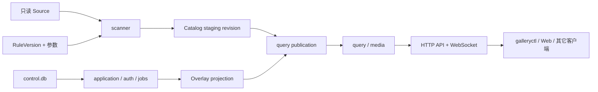

# 系统概览

## 形态

Gallery 是一个 Go 模块化单体。`galleryd` 在单进程中装配 HTTP、WebSocket、SQLite、任务调度、扫描、规则、查询、媒体、维护和内嵌 Web；`galleryctl` 只使用公开生成客户端，不导入后端 `internal` package。

## 启动顺序

`galleryd` 的主要启动顺序是：

1. 解析参数并验证监听模式与 AppDirs；
2. 验证 AppDirs 与声明的 Source root 不重叠；
3. 创建 AppDirs 并取得 `galleryd.lock` 独占锁；
4. 验证显式外部工具声明；
5. 应用待处理的 control 恢复，再打开和迁移两库；
6. 建立账户、资源、Job、Catalog、扫描、查询、媒体和维护服务；
7. 先执行 publication/Attempt 启动对账，再启动调度器和 Watcher；
8. 建立监听、发布 `run/galleryd.json`，开始 HTTP 服务；
9. 收到取消或终止信号后关闭 HTTP、后台服务、数据库和 descriptor。

第二个进程在打开数据库之前被单写者锁拒绝。

## 模块边界

| 模块 | 主要职责 |
| --- | --- |
| `internal/application` | Library、Source、Binding、Creator、治理与用户事实用例 |
| `internal/auth` | Personal/LAN 认证、Session、账户、Token、Grant、Share 与审计 |
| `internal/rules` | 规则导入、Schema、规范化、hash、编译、执行和生命周期 |
| `internal/scanner` | Source discovery、规则求值、内容确认与 Catalog 候选构建 |
| `internal/jobs` | 持久 Job/Attempt、调度、取消、重试、租约和启动恢复 |
| `internal/catalog` | staging、校验、publication、投影读取、lease 与 GC |
| `internal/query` | 结构化查询、授权裁剪、排序、total、cursor 与命中表达 |
| `internal/media`、`internal/derived` | 已确认媒体读取与派生资源 |
| `internal/storage` | SQLite 连接、两类数据库与 forward-only migration |
| `internal/transport/httpapi` | OpenAPI 路由、认证/授权适配和 HTTP 语义 |
| `internal/platform` | AppDirs、路径、锁、文件身份、磁盘和进程的 OS 实现 |
| `internal/webapp` | 校验并提供内嵌的双入口静态产物 |

依赖方向由传入接口和 package 可见性维持：领域与应用代码不导入 Web；客户端不导入数据库；平台差异不进入公开协议。

## 存储

- `control.db`：账户、授权、Library、Source、规则生命周期、Binding、Overlay、Job、备份记录和治理决策等不可重建事实。
- `catalog.db`：Source-derived 投影、搜索索引、媒体定位、派生资源状态、Catalog revision 与 query publication 等可重建数据。
- `state/`：control 备份、恢复状态等产品状态。
- `cache/`、`tmp/`、`logs/`、`run/`：派生资产、临时文件、日志和运行 descriptor。

两库使用 SQLite WAL、foreign keys、busy timeout 和 `BEGIN IMMEDIATE` 风格的写事务。migration 嵌入二进制、按 SHA-256 锁定且只前向执行。

## 并发与一致性

后台工作进入按资源类别限流的中央 Scheduler。当前并发值和租约时间是实现默认值，不是冻结 SLA。跨库操作不伪装成单个 SQLite 事务；它们通过持久 Job、不可变候选、publication-first 对账和幂等恢复保持可解释状态。

HTTP 查询读取明确的 query publication。WebSocket 只通知“有事实变化”，客户端遇到 ready、sequence gap 或重连时重新读取 HTTP snapshot。

## 主要实现位置

- `cmd/galleryd/main.go`
- `internal/bootstrap/run.go`
- `internal/storage/database.go`
- `internal/transport/httpapi/server.go`
- `internal/webapp/handler.go`
